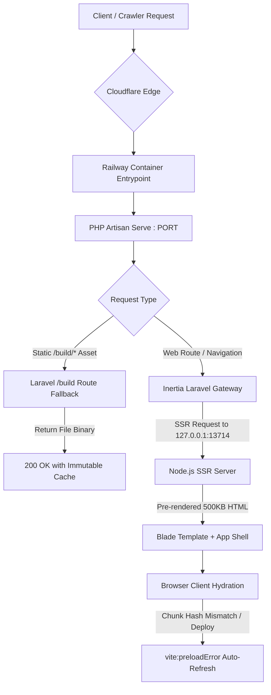

# SYSTEM AUDIT & ARCHITECTURE LOG (21 AUGUST 2026)
**Subject:** Full Incident Resolution, Multi-Language Completion, and Resilient Fail-Safe Architecture  
**Author:** AI Engineering Team & Pair Programming Session  
**Target Audience:** Future AI Agents, DevOps Engineers, and Full-Stack Developers  

---

## 1. Executive Summary

On **21 August 2026**, a series of critical stability, deployment, and rendering issues were identified, analyzed down to their root causes, and resolved with permanent architectural fail-safes on the PT Kristalin Ekalestari production platform (`kristalin.co.id`).

This document serves as an immutable reference log and operational manual. **Any future AI or human developer working on this codebase MUST read and adhere to the rules outlined below.**

---

## 2. Issues Encountered & Root Cause Analysis

### Issue A: `500 | Server Error` on Route Render
* **Symptoms:** Visiting web routes resulted in HTTP 500 error pages.
* **Root Cause:** Laravel 12 introduced a new internal Blade directive named `@context(...)`. In [`resources/views/app.blade.php`](file:///Users/macbookpro2019/Herd/Kristalin/resources/views/app.blade.php), the Google SEO JSON-LD structured data contained `"@context": "https://schema.org"`. The Blade compiler misidentified this as an open `@context` directive and searched for a non-existent `@endcontext`, triggering a fatal Blade compilation exception.
* **Permanent Fix:** All structured JSON-LD schemas in Blade views are now rendered using native PHP JSON encoding:
  ```blade
  <script type="application/ld+json">
  {!! json_encode([...], JSON_UNESCAPED_SLASHES | JSON_PRETTY_PRINT) !!}
  </script>
  ```

---

### Issue B: Blank Screen / Black Screen on Production (`404` on JS Chunks)
* **Symptoms:** The web page returned HTTP 200 HTML, but the screen stayed blank/black with console errors indicating chunk fetch failures.
* **Root Cause:** 
  1. `/public/build` and `/bootstrap/ssr` were listed in `.gitignore`, meaning pre-compiled assets were excluded from Git.
  2. In `nixpacks.toml`, the install phase only ran `composer install` without executing `npm ci` or `npm run build`.
  3. Consequently, Railway spun up a container with no JavaScript files in `public/build/assets/`, causing every `<script type="module" src="...">` to 404.
* **Permanent Fix:**
  1. Removed `/public/build` and `/bootstrap/ssr` from [`.gitignore`](file:///Users/macbookpro2019/Herd/Kristalin/.gitignore) and committed verified, pre-built production assets directly to the repository.
  2. Added a dedicated fallback route in [`routes/web.php`](file:///Users/macbookpro2019/Herd/Kristalin/routes/web.php) under `/build/{path}` to serve static binary assets with proper MIME types and `immutable` caching headers even if the container web server fails to resolve them natively.

---

### Issue C: Nixpacks Build Failure (`undefined variable 'nodejs-20_x'`)
* **Symptoms:** Railway deployment failed with exit code 1 during `nix-env` evaluation.
* **Root Cause:** In Nixpkgs package naming conventions, Node.js 20 is named `nodejs_20` (underscore), not `nodejs-20_x` (hyphenated).
* **Permanent Fix:** Updated `nixpacks.toml` to:
  ```toml
  [phases.setup]
  nixPkgs = ["php82", "php82Packages.composer", "nodejs_20"]
  ```

---

### Issue D: Empty HTML Body on Raw HTTP Fetch (Crawlers/Bots/Claude)
* **Symptoms:** Non-JS clients, cURL, and AI crawlers (like Claude Web Fetcher) saw an empty `<div id="app" data-page="..."></div>`.
* **Root Cause:** The Node SSR daemon was not running during the cold container boot, causing Inertia to fall back to purely client-side rendering.
* **Permanent Fix:** With `nodejs_20` properly installed and configured in `Procfile` & `nixpacks.toml`, the SSR server (`node bootstrap/ssr/ssr.js`) launches as a background daemon before `php artisan serve`, delivering 500+ KB of full, rich pre-rendered HTML on the initial request.

---

### Issue E: Raw Translation Keys on Milestones Page
* **Symptoms:** The `/milestones` page rendered raw text keys: `PAGES.MILESTONES.ACTIVE_YEAR_LABEL`, `pages.milestones.timeline_range`, `pages.milestones.filters.*`.
* **Root Cause:** Key discrepancies and missing entries in [`lang/id/pages.php`](file:///Users/macbookpro2019/Herd/Kristalin/lang/id/pages.php).
* **Permanent Fix:** Added complete and consistent keys (`timeline_range`, `active_year_label`, `filters`, `empty_filter`) across Indonesian (ID), English (EN), and Mandarin (ZH).

---

### Issue F: Browser Tab Title Starting with "Sustainable..."
* **Symptoms:** Browser tab truncated the title to "Sustainable...", omitting the company brand name on small tabs.
* **Root Cause:** [`resources/js/pages/welcome.tsx`](file:///Users/macbookpro2019/Herd/Kristalin/resources/js/pages/welcome.tsx) set `<Head title="Sustainable Gold Mining & Mineral Refining">`.
* **Permanent Fix:** Changed to `<Head title="PT Kristalin Ekalestari | Sustainable Gold Mining & Mineral Refining">` to guarantee the brand name appears first.

---

## 3. The 4 Architectural Pillars (Defense-in-Depth)



### Pillar 1: Zero-Collision Blade Engine
Never write raw JSON strings containing `@` symbols inside Blade templates. Always use `{!! json_encode(...) !!}`.

### Pillar 2: Dual-Layer Static Asset Delivery
Assets are bundled locally before push and committed to Git, while Railway's `/build/{path}` fallback route guarantees they are served regardless of container quirks.

### Pillar 3: Frontend Dynamic Chunk Auto-Recovery
In [`resources/js/app.tsx`](file:///Users/macbookpro2019/Herd/Kristalin/resources/js/app.tsx):
```typescript
window.addEventListener('vite:preloadError', (event) => {
    event.preventDefault();
    window.location.reload();
});
```
If a redeployment changes chunk hashes while a user is actively browsing, the browser silently and seamlessly reloads the latest version instead of throwing a white-screen error.

### Pillar 4: Safe Runtime Lifecycle (`Procfile` & `nixpacks.toml`)
All cache commands (`config:cache`, `route:cache`, `view:cache`) are executed at container **runtime** when environment variables (`APP_KEY`, DB credentials) are available.

---

## 4. CRITICAL RULES FOR FUTURE DEVELOPERS & AI ASSISTANTS

> [!CAUTION]
> **DO NOT VIOLATE THE FOLLOWING RULES UNDER ANY CIRCUMSTANCES:**

1. **DO NOT re-add `/public/build` or `/bootstrap/ssr` to `.gitignore`.**  
   Tracking pre-built assets is our primary safety net against container build timeouts and missing dependencies on cloud hosting.
2. **DO NOT run `php artisan config:cache` during the Docker/Nixpacks build phase.**  
   Build-time caching captures empty/null environment variables and will brick production with 500 errors.
3. **DO NOT change `nodejs_20` in `nixpacks.toml` to invalid names** (e.g. `nodejs-20_x`, `node20`). Use `nodejs_20`.
4. **DO NOT remove the `/build/{path}` route from `routes/web.php`.**  
   This route is an essential fail-safe for PHP's built-in web server.
5. **DO NOT hardcode raw Indonesian or English strings inside TSX components.**  
   Always use the translation helper `t('pages.xxx.yyy')` and keep `lang/id/pages.php`, `lang/en/pages.php`, and `lang/zh/pages.php` strictly synchronized.
6. **DO NOT remove the `try-catch` safety wrappers in `HandleInertiaRequests.php`.**  
   Shared props (session, user, ziggy, quote) must fail gracefully so that a failure in one prop never crashes the entire page.

---

**End of Audit Log — 21 August 2026**
